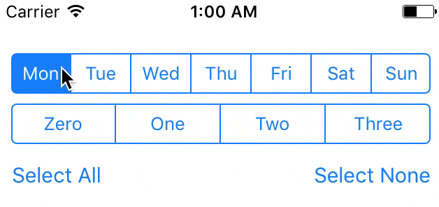

[](https://developer.apple.com/swift)
[]()

###Swift 3.0.1

# MultiSelectSegmentedControl
*multiple selection segmented control rewritten from [yonat Obj-C lib](https://github.com/yonat/MultiSelectSegmentedControl)*



A subclass of UISegmentedControl that supports selection multiple segments.

No need for images - works with the builtin styles of UISegmentedControl.

**Usage**

Drag a `UISegmentedControl` into your view in Interface Builder.

Set its class to `MultiSelectSegmentedControl`.

Set an outlet for it, perhaps calling it something creative such as `myMultiSeg`.

Set the selected segments:
``` swift
//to select 1 and 2 segments
myMultiSeg.selectedSegmentIndexes = IndexSet(integersIn: 1...2)
//to select 4 segment in addition to 1 and 2
myMultiSeg.selectedSegmentIndexes.insert(4)
//to select just 2 segment
myMultiSeg.selectedSegmentIndexes = IndexSet(integer: 2)
```

Get the selected segment indices:
``` swift
let selectedIndices: IndexSet = myMultiSeg.selectedSegmentIndexes
```

Get the selected segment titles:
``` oswiftbjc
print("These items are selected: \(myMultiSeg.selectedSegmentTitles)")
```

If you want to be notified of changes to the control's value, make sure your ViewController conforms to the delegate protocol

```swift
class YourAwesomeViewController: UIViewController, MultiSelectSegmentedControlDelegate {
```

...and set the delegate, perhaps in your `viewDidLoad` method:

``` swift
myMultiSeg.delegate = self
```

You are notified of changes through the following method:
``` swift
func multiSelect(multiSelectSegmendedControl: MultiSelectSegmentedControl, didChangeValue value: Bool, atIndex index: Int) {
    print("multiSelect delegate selected: \(value) atIndex: \(index)")
}
```
